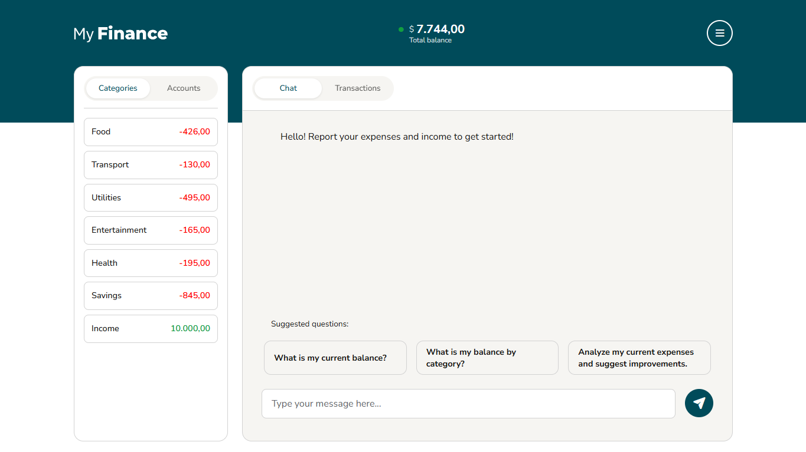
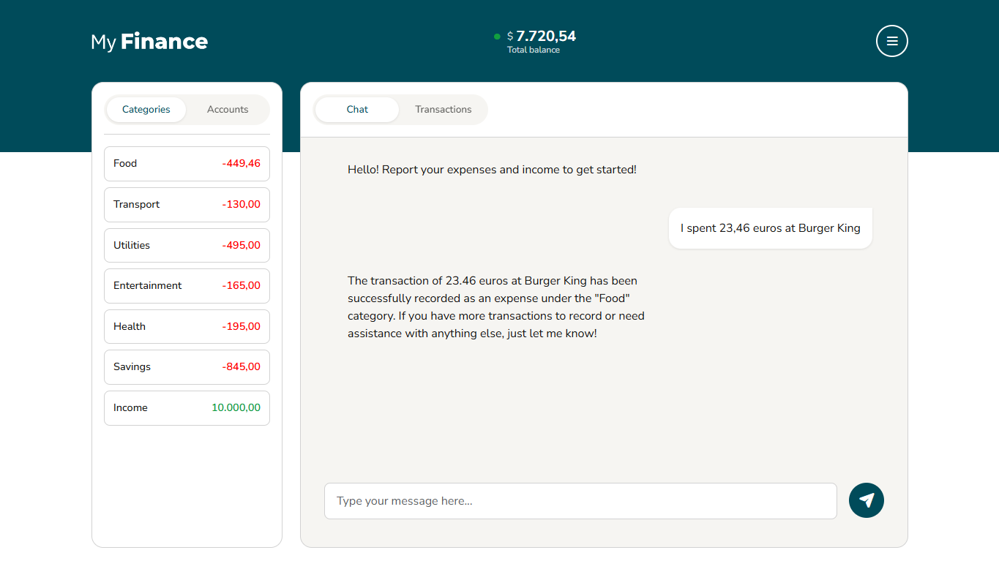
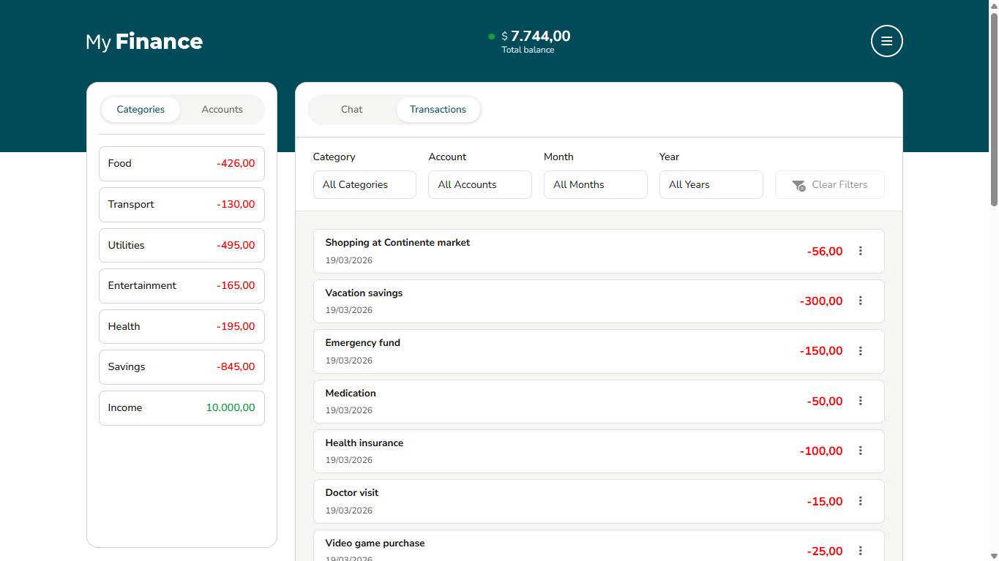

# MyFinance

[](LICENSE)
[](https://openjdk.org/)
[](https://spring.io/projects/spring-boot)
[](https://angular.dev)
[](CONTRIBUTING.md)

Personal finance management system with AI-powered chat assistant using LangChain4j and Angular.

---

📚 **[Getting Started](#quick-start)** | 🤝 **[Contributing](CONTRIBUTING.md)** | 🔒 **[Security](SECURITY.md)** | 📖 **[Documentation](#documentation)**

---



**Intelligent Chat Interface** - Register transactions using natural language with AI-powered assistance. The system understands your input and automatically categorizes expenses, detects amounts, and assigns them to the correct bank account.



**Advanced Transaction Management** - Browse all your financial records with powerful filtering options by category, bank account, month, and year. View detailed transaction history with inline editing and deletion capabilities. All these operations can also be performed through the AI chat using natural language commands.



**Real-time Balance Overview** - Monitor your finances with live balance calculations displayed in an elegant sidebar. Track spending by category and account with color-coded visual indicators for income (green) and expenses (red).

Personal finance management system with AI-powered chat assistant using LangChain4j and Angular.

## Project Structure

This is a monorepo containing both backend and frontend applications:

```
myFinance/
├── api/                    # Java Spring Boot backend
│   ├── src/               # Java source code
│   ├── pom.xml           # Maven configuration
│   ├── README.md         # Backend documentation
│   └── TOOL_CALLING_GUIDE.md  # AI tools documentation
├── web/                    # Angular 19 frontend
│   ├── src/               # Angular source code
│   ├── package.json      # npm dependencies
│   └── README.md         # Frontend documentation
├── docker-compose.yml     # PostgreSQL + pgvector database
├── start-dev.ps1         # PowerShell script to start all services
└── README.md             # This file
```

## Quick Start

### Prerequisites
- Java 21 or higher
- Maven 3.6+
- Docker & Docker Compose
- Node.js 18+
- Angular CLI 19+

### Configuration

#### 1. Environment Variables Setup

Copy the example environment file and configure your credentials:

```bash
cp .env.example .env
```

Edit the `.env` file with your configuration:

```env
# Database Configuration
POSTGRES_DB=myfinance
POSTGRES_USER=postgres
POSTGRES_PASSWORD=your_secure_password_here
DB_HOST=localhost
DB_PORT=5433

# OpenAI Configuration
OPENAI_API_KEY=sk-your-openai-api-key-here
OPENAI_MODEL=gpt-4o-mini
OPENAI_EMBEDDING_MODEL=text-embedding-3-small

# Application Configuration
CORS_ALLOWED_ORIGINS=http://localhost:4200
```

**Important**: 
- Never commit the `.env` file to version control (already in `.gitignore`)
- Use strong passwords for production environments
- Keep your OpenAI API key secure
- The `.env.example` file serves as a template with safe default values

#### 2. Get Your OpenAI API Key

1. Visit [OpenAI Platform](https://platform.openai.com/)
2. Sign up or log in to your account
3. Navigate to [API Keys](https://platform.openai.com/api-keys)
4. Click "Create new secret key"
5. Copy the key and paste it into your `.env` file

### Option 1: Start All Services (Windows)

```powershell
.\start-dev.ps1
```

This script will:
1. Load environment variables from `.env`
2. Start PostgreSQL database with your configured credentials
3. Start backend API on port 8080
4. Start Angular dev server on port 4200

### Option 2: Manual Start

#### 1. Start Database
```bash
docker-compose up -d
```

The database will use the credentials from your `.env` file.

#### 2. Run Backend

The backend uses the `local` profile which reads from environment variables.

On **Windows PowerShell**:
```powershell
cd api
mvn spring-boot:run -Dspring-boot.run.profiles=local
```

On **Linux/macOS**:
```bash
cd api
mvn spring-boot:run -Dspring-boot.run.profiles=local
```

The `application-local.yml` is already configured to read from the same environment variables as your `.env` file.

**Note**: If you need to override specific settings, you can edit `api/src/main/resources/application-local.yml` directly (it's already in `.gitignore` for safety).

#### 3. Run Frontend
```bash
cd web
npm install
npm start
```

Access the application at `http://localhost:4200`

### Environment Variables Reference

| Variable | Description | Default | Required |
|----------|-------------|---------|----------|
| `POSTGRES_DB` | Database name | `myfinance` | No |
| `POSTGRES_USER` | Database username | `postgres` | No |
| `POSTGRES_PASSWORD` | Database password | `postgres` | **Yes** (for production) |
| `DB_HOST` | Database host | `localhost` | No |
| `DB_PORT` | Database port | `5433` | No |
| `OPENAI_API_KEY` | OpenAI API key for AI features | - | **Yes** |
| `OPENAI_MODEL` | OpenAI chat model | `gpt-4o-mini` | No |
| `OPENAI_EMBEDDING_MODEL` | OpenAI embedding model | `text-embedding-3-small` | No |
| `CORS_ALLOWED_ORIGINS` | Allowed CORS origins | `http://localhost:4200` | No |

### Docker Compose Configuration

The `docker-compose.yml` file is configured to use environment variables from your `.env` file. All database credentials are parameterized for security:

```yaml
services:
  postgres:
    environment:
      POSTGRES_DB: ${POSTGRES_DB:-myfinance}
      POSTGRES_USER: ${POSTGRES_USER:-postgres}
      POSTGRES_PASSWORD: ${POSTGRES_PASSWORD:-postgres}
    ports:
      - "${DB_PORT:-5433}:5432"
```

The syntax `${VARIABLE:-default}` means: use the environment variable if set, otherwise use the default value.

## Security Best Practices

### 🔒 Protecting Sensitive Information

1. **Never commit `.env` file to version control**
   - The `.env` file is already in `.gitignore`
   - Always use `.env.example` as a template with placeholder values
   - Share configuration instructions, not actual credentials

2. **Use strong passwords**
   - Change default database password in production
   - Use complex passwords with mixed characters
   - Consider using a password manager

3. **Secure your OpenAI API Key**
   - Keep your API key confidential
   - Rotate keys periodically
   - Set usage limits in OpenAI dashboard
   - Monitor API usage for unexpected activity

4. **Environment-specific configuration**
   ```bash
   # Development
   POSTGRES_PASSWORD=postgres
   OPENAI_MODEL=gpt-4o-mini
   
   # Production
   POSTGRES_PASSWORD=strong_random_password_here
   OPENAI_MODEL=gpt-4o
   ```

5. **For production deployments**
   - Use secret management services (AWS Secrets Manager, Azure Key Vault, etc.)
   - Enable HTTPS/TLS for all connections
   - Update `CORS_ALLOWED_ORIGINS` to your production domain
   - Set up database connection encryption
   - Use environment variables from your hosting platform

### 📋 Pre-deployment Checklist

- [ ] Changed default database password
- [ ] Added valid OpenAI API key
- [ ] Updated CORS origins for production domain
- [ ] Reviewed and removed development-only settings
- [ ] Tested with production-like configuration
- [ ] Verified `.env` is in `.gitignore`

## Features

### Frontend (Angular 19)
- 🤖 **AI Chat Interface** - Natural language interaction with financial data
- 💬 **Real-time Chat** - Markdown rendering with code highlighting
- 📊 **Smart Sidebar** - Categories and bank accounts with live balances
- 🔄 **Auto-refresh** - Balance updates after transactions
- 📱 **Responsive Design** - Mobile-first layout (hides sidebar on <992px)
- 🌍 **Internationalization** - 6 languages (EN, PT, ES, FR, DE, IT)
- ✨ **Skeleton Loading** - Smooth loading states for sidebar and modals
- 📋 **Transaction Modal** - View filtered transactions by category/account
- 🎨 **Modern UI** - Toggle-style tabs, color-coded balances
- 🍪 **Cookie Consent** - GDPR-compliant cookie banner
- 🔒 **Privacy & Terms** - Static pages for legal content

### Backend (Spring Boot 3.5.3)
- 🤖 **AI Assistant** - OpenAI GPT-4 with LangChain4j integration
- 🧠 **Smart Context** - ThreadLocal-based transaction detection
- 📅 **Intelligent Dates** - Auto-defaults to current date (2026-03-11)
- 🛠️ **11 AI Tools** - Natural language CRUD operations
- 💾 **PostgreSQL + pgvector** - Vector embeddings for chat memory
- 🔄 **Flyway Migrations** - Version-controlled database schema
- 📝 **RESTful API** - Complete CRUD for transactions, categories, accounts
- 💰 **Balance Calculations** - Total, by account, by category

## Technology Stack

### Backend
- **Framework**: Spring Boot 3.5.3
- **Language**: Java 21
- **AI**: LangChain4j 1.0.0-beta5 + OpenAI GPT-4
- **Database**: PostgreSQL + pgvector extension
- **Migrations**: Flyway
- **Build**: Maven

### Frontend
- **Framework**: Angular 19 (standalone components)
- **Language**: TypeScript
- **State**: RxJS observables
- **i18n**: ngx-translate
- **Styling**: SCSS with CSS custom properties
- **Icons**: Font Awesome
- **Markdown**: ngx-markdown with Prism.js
- **Build**: Angular CLI + esbuild

## Application Architecture

### Frontend Structure
```
web/src/app/
├── components/          # Reusable components
│   ├── layout/         # Header, footer
│   └── cookie-consent/ # GDPR banner
├── pages/              # Route components
│   ├── chat/          # Main chat interface with sidebar
│   ├── privacy/       # Privacy policy
│   └── terms/         # Terms of service
├── services/          # API services and state management
│   ├── chat.service.ts
│   ├── balance-refresh.service.ts
│   └── transaction.service.ts
├── models/            # TypeScript interfaces
└── shared/            # Pipes, utilities
    ├── pipes/         # Currency formatting
    └── message/       # Chat message component
```

### Backend Structure
```
api/src/main/java/com/myfinance/
├── ai/                    # LangChain4j AI tools
│   ├── FinanceAssistant.java    # AI service interface
│   ├── TransactionTools.java    # Transaction CRUD tools
│   ├── TransactionContext.java  # ThreadLocal context tracking
│   └── BalanceTools.java        # Balance query tools
├── controller/               # REST endpoints
│   ├── AssistantController.java
│   ├── TransactionController.java
│   └── dto/                 # Request/Response DTOs
├── model/                   # JPA entities
│   ├── Transaction.java
│   ├── TransactionType.java (CREDIT/DEBIT)
│   └── Category.java
├── repository/             # Spring Data JPA
└── service/               # Business logic
    └── ChatService.java   # AI interaction + context management
```

## Key Features Explained

### Smart Transaction Detection
The backend uses `TransactionContext` (ThreadLocal) to track when AI tools create/modify transactions, ensuring balance refresh only happens when needed.

### Multi-language Support
Supported languages with route-based switching:
- English (EN)
- Portuguese (PT)
- Spanish (ES)
- French (FR)
- German (DE)
- Italian (IT)

### Responsive Sidebar
- **Desktop (≥992px)**: Sidebar (25%) + Chat (75%)
- **Mobile (<992px)**: Chat only (100%), sidebar hidden

### Transaction Modal
Click any category or bank account in the sidebar to view filtered transactions with:
- Description/Category name
- Transaction date
- Value with color coding (green=CREDIT, red=DEBIT)

## Development

### Run Tests
```bash
# Backend
cd api
mvn test

# Frontend
cd web
npm test
```

### Build for Production
```bash
# Backend
cd api
mvn clean package

# Frontend
cd web
npm run build
```

### Code Quality
```bash
# Format backend code
cd api
mvn spotless:apply

# Lint frontend
cd web
npm run lint
```

## API Endpoints

### Transactions
- `GET /api/transactions` - List all
- `POST /api/transactions` - Create
- `PUT /api/transactions/{id}` - Update
- `DELETE /api/transactions/{id}` - Delete

### Categories
- `GET /api/categories` - List all
- `POST /api/categories` - Create

### Bank Accounts
- `GET /api/bank-accounts` - List all
- `POST /api/bank-accounts` - Create

### Balance
- `GET /api/balance/total` - Total balance
- `GET /api/balance/by-bank-account` - By account
- `GET /api/balance/by-category` - By category

### AI Assistant
- `POST /api/assistant/chat` - Send message
- `GET /api/assistant/history/{userId}` - Chat history

## Environment Configuration

### Backend (`api/src/main/resources/application-local.yml`)
```yaml
spring:
  datasource:
    url: jdbc:postgresql://localhost:5433/myfinance
    username: postgres
    password: postgres
  
langchain4j:
  open-ai:
    chat-model:
      api-key: sk-...
      model-name: gpt-4
      temperature: 0.7
    embedding-model:
      api-key: sk-...
```

### Frontend (uses proxy for API calls)
Proxy configuration in `web/proxy.conf.json` redirects `/api/*` to `http://localhost:8080`

## Database Schema

Tables:
- `users` - User accounts
- `categories` - Expense/Income categories (user-scoped)
- `bank_accounts` - Bank accounts (user-scoped)
- `transactions` - Financial transactions (CREDIT/DEBIT)
- `messages` - Chat message history with embeddings

## Contributing

We welcome contributions to MyFinance! Here's how you can help:

### Getting Started

1. **Fork the repository** on GitHub
2. **Clone your fork** locally:
   ```bash
   git clone https://github.com/your-username/myFinance.git
   cd myFinance
   ```
3. **Set up your environment** following the Quick Start guide above
4. **Create a feature branch**:
   ```bash
   git checkout -b feature/your-feature-name
   ```

### Development Workflow

1. **Make your changes**
   - Write clean, readable code
   - Follow existing code style and conventions
   - Add comments for complex logic
   - Update documentation as needed

2. **Test your changes**
   - Test locally with the development setup
   - Ensure all existing features still work
   - Test edge cases and error scenarios

3. **Commit your changes**
   ```bash
   git add .
   git commit -m "feat: add description of your feature"
   ```
   
   Use conventional commit messages:
   - `feat:` - New feature
   - `fix:` - Bug fix
   - `docs:` - Documentation changes
   - `refactor:` - Code refactoring
   - `test:` - Adding tests
   - `chore:` - Maintenance tasks

4. **Push to your fork**
   ```bash
   git push origin feature/your-feature-name
   ```

5. **Submit a Pull Request**
   - Go to the original repository on GitHub
   - Click "New Pull Request"
   - Select your fork and branch
   - Describe your changes clearly
   - Link any related issues

### What to Contribute

- 🐛 **Bug fixes** - Found a bug? Please report or fix it!
- ✨ **New features** - Have an idea? Open an issue first to discuss
- 📝 **Documentation** - Improve README, add examples, fix typos
- 🌍 **Translations** - Add new language support to the frontend
- 🎨 **UI/UX improvements** - Make the interface better
- ⚡ **Performance** - Optimize slow operations
- 🧪 **Tests** - Increase test coverage

### Code of Conduct

- Be respectful and inclusive
- Provide constructive feedback
- Help others learn and grow
- Keep discussions on topic

### Questions?

- Open an issue for bugs or feature requests
- Start a discussion for general questions
- Check existing issues before creating new ones

### Development Resources

- **Backend**: See [api/README.md](api/README.md) for detailed backend documentation
- **Frontend**: See [web/README.md](web/README.md) for Angular setup
- **AI Tools**: See [api/TOOL_CALLING_GUIDE.md](api/TOOL_CALLING_GUIDE.md) for LangChain4j details

Thank you for contributing to MyFinance! 🙏

## Troubleshooting

### Database connection failed
```bash
# Check if PostgreSQL is running
docker ps | grep postgres

# Restart database
docker-compose restart
```

### Backend won't start
```bash
# Check Java version
java -version  # Should be 17+

# Clean build
cd api
mvn clean install
```

### Frontend errors
```bash
# Clear node_modules and reinstall
cd web
rm -rf node_modules package-lock.json
npm install
```

### OpenAI API errors
- Verify API key is valid
- Check rate limits
- Ensure sufficient credits

### Maven build fails
```bash
# Clean and rebuild
cd api
mvn clean install
```

### Frontend not loading
```bash
# Clear Angular cache
cd web
rm -rf node_modules .angular
npm install
```

## Documentation

### Project Documentation
- **[CONTRIBUTING.md](CONTRIBUTING.md)** - How to contribute to this project
- **[SECURITY.md](SECURITY.md)** - Security policies and best practices
- **[CODE_OF_CONDUCT.md](CODE_OF_CONDUCT.md)** - Community guidelines

### Component Documentation
- **[api/README.md](api/README.md)** - Backend API documentation
- **[api/TOOL_CALLING_GUIDE.md](api/TOOL_CALLING_GUIDE.md)** - LangChain4j AI tools guide
- **[web/README.md](web/README.md)** - Frontend setup and architecture
- **[web/INTEGRATION_GUIDE.md](web/INTEGRATION_GUIDE.md)** - Frontend integration guide

## License

This project is licensed under the MIT License - see the [LICENSE](LICENSE) file for details.

## Acknowledgments

- [Spring Boot](https://spring.io/projects/spring-boot) - Backend framework
- [Angular](https://angular.dev) - Frontend framework
- [LangChain4j](https://docs.langchain4j.dev) - AI integration library
- [OpenAI](https://openai.com) - AI models
- [pgvector](https://github.com/pgvector/pgvector) - Vector similarity search

## Support

- 📧 **Issues**: [GitHub Issues](https://github.com/your-username/myFinance/issues)
- 💬 **Discussions**: [GitHub Discussions](https://github.com/your-username/myFinance/discussions)
- 📖 **Documentation**: See [Documentation](#documentation) section above

---

Made with ❤️ by the MyFinance community
